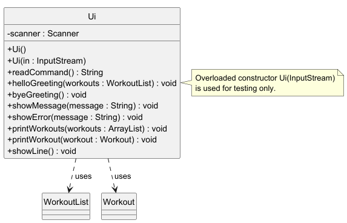
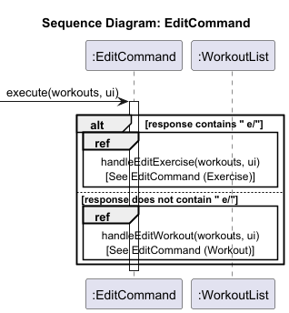

# Developer Guide

## Setup Guide
### Steps
1. Clone the repository to your local machine:
   ```bash
   git clone https://github.com/AY2526S2-CS2113-W10-3/tp
2. navigate into the project directory:
   ```bash
   cd tp
3. Run the application using Gradle:
   ```bash
   ./gradlew run

## Design

The **Architecture Diagram** below gives a high-level design overview of GitSwole.


Given below is a quick overview of the main components and how they interact with each other.

#### Main components of the architecture

**`GitSwole`** (the class `GitSwole.java`) is in charge of app launch and shut down:
- **At app launch:** It calls `setupLogger()`, instantiates `Ui` and `Storage`, loads persisted workout data into a `WorkoutList`, then enters the main command loop via `run()`.
- **At shut down:** When `Command.isExit()` returns `true`, the loop exits cleanly, and the application terminates.

The bulk of the app's work is done by the following four components:
- [**`UI`**](#ui-component): The user interface — responsible for reading raw user input and displaying all formatted output back to the terminal.
- [**`Parser`**](#parser-component): The command interpreter — handles complex string processing and flag extraction (e.g., `w/`, `e/`) to translate raw user input into executable `Command` objects.
- [**`Command`**](#command-component): The command executor — each subclass encapsulates the specific business logic for one operation (e.g., `AddCommand`, `DeleteCommand`).
- [**`Storage`**](#storage-component): The data persistence layer — manages file I/O operations for `workouts.txt` (templates) and `history.txt` (session logs).

**`Assets`** represents the in-memory data model, consisting of `WorkoutList`, `Workout`, and `Exercise`. **`Commons`** contains shared utility classes (e.g., `GitSwoleException`) used across all components.

#### How the architecture components interact with each other

The *Sequence Diagram* below shows how the components interact with each other for the scenario 
where the user issues the command `add w/Push Day`.


Each of the four main components:
- defines its API through a well-scoped class boundary.
- implements its functionality using a concrete class that can be substituted or tested independently.

### UI Component

**API:** `Ui.java`

The `Ui` component handles all interaction with the user - it reads raw input and
renders all output to the console. It has no knowledge of business logic or the data model.

It exposes the following key operations:
- `helloGreeting(WorkoutList)` - renders the startup banner, progress snapshot, and tier status.
- `byeGreeting()` - renders a goodbye message when the application terminates
- `readCommand()` - reads a single line of input from `System.in`.
- `showMessage(String)` - prints any general output line.
- `showError(String)` - prints a formatted error message wrapped in separator lines.
- `printWorkouts(ArrayList<Workout>)` - iterates through and prints all workouts and their exercises.
- `printWorkout(Workout)` - prints a single workout and its exercise list.
- `showLine()` - prints a horizontal separator for visual clarity.

> **Note:** `Ui` provides an overloaded constructor `Ui(InputStream in)` used exclusively
> for testing, allowing simulated input to be injected without modifying the production code path.



---

### Parser Component

**API:** `Parser.java`

The `Parser` component receives the raw input string from `GitSwole` and maps it to the
correct `Command` subclass. It uses an internal `HashMap<String, CommandType>` to perform
O(1) keyword lookups, avoiding long if-else chains.

It exposes the following key operations:
- `readResponse(String, WorkoutList)` - the main entry point; parses the full input string
  and returns a ready-to-execute `Command` object.
- `parseValue(String, String)` *(static)* - extracts the value of a named flag
  (e.g. `w/`, `e/`, `wt/`) from the input string using regex boundary detection.
- `parseOptionalInt(String, String, int)` *(static)* - extracts an optional integer flag
  value, returning a default if the flag is absent or malformed.

The following commands are currently recognised:

| Keyword | Maps to |
|---|---|
| `add` | `AddCommand` |
| `delete` | `DeleteCommand` |
| `edit` | `EditCommand` |
| `find` | `FindCommand` |
| `list` | `ListCommand` |
| `mark` / `unmark` | `MarkCommand` |
| `log` | `LogCommand` |
| `loglist` | `LogListCommand` |
| `help` | `HelpCommand` |
| `exit` | `ExitCommand` |

> **Note:** `parseValue` and `parseOptionalInt` are `public static` methods, allowing
> `Command` subclasses to reuse the same flag-parsing logic directly without re-instantiating
> a `Parser`.


---

### Command Component

**API:** `Command.java`

The `Command` component defines the contract that all executable actions must follow.
`Command` is an abstract class with a single abstract method:

```java
public abstract void execute(WorkoutList workouts, Ui ui) throws GitSwoleException;
```

Each concrete subclass encapsulates the full logic for exactly one user-facing operation.
The subclasses are:

- `AddCommand` - adds a new `Workout` or `Exercise` to the `WorkoutList`.
- `DeleteCommand` - removes a `Workout` or `Exercise` by index.
- `EditCommand` - modifies the name of an existing `Workout` or `Exercise`.
- `FindCommand` - searches for workouts by keyword.
- `ListCommand` - lists workouts at summary, workout-specific, or full-detail scope.
- `MarkCommand` - marks or unmarks a `Workout` as done.
- `LogCommand` - initialises a workout logging session or logs an individual exercise stat.
- `LogListCommand` - displays the full workout history from `HistoryStorage`.
- `HelpCommand` - displays all available commands and their formats.
- `ExitCommand` - sets `isExit = true` to signal the main loop to terminate.

The `isExit()` method is defined in the base class and returns `false` for all commands
except `ExitCommand`, which overrides it to return `true`.


---

### Storage Component

**API:** `Storage.java`, `HistoryStorage.java`

The `Storage` component is responsible for persisting and loading application data
to and from plain text files on disk. It is split into two classes with distinct responsibilities:

**`Storage.java`** manages the primary workout data file. It uses a structured
pipe-delimited format:


## Implementation

The design of GitSwole follows a modular architecture inspired by the N-tier pattern, specifically tailored for a 
CLI-based CRUD application. The system is divided into four primary logic components: `UI`, `Parser`, `Command`, 
and `Storage`. These components interact with a central `Assets` data model to perform operations. The application is 
designed to be extensible, allowing new commands and storage formats to be added with minimal friction by extending the 
base `Command` class and utilizing dedicated storage handlers.

### Praveen's enhancement

This enhancement introduces a robust workout logging and history tracking system, along with a multi-tiered listing 
mechanism. It is composed of the `ListCommand`, `LogCommand`, `LogListCommand`, `HistoryStorage` classes, and the 
`history.txt` persistent file.

#### 1. Tiered Listing Feature (`ListCommand`)
The listing enhancement allows users to view their data at three different granularities without needing multiple, 
fragmented commands.

* **Implementation:**
    `ListCommand` extends the base `Command` class. It uses string matching on the parsed user input to route execution 
to one of three helper methods:
    - `handleListSummary()`: Triggered by `list`. Iterates through `WorkoutList` to show names and completion status.
    - `handleListWorkout()`: Triggered by `list w/`. Fetches a specific `Workout` and displays its nested `Exercise` list.
    - `handleListAll()`: Triggered by `list all`. Performs a deep iteration across all workouts and their exercises.

* **Design Considerations:**
    - **Why it is implemented this way:** Handling all list variations within a single `ListCommand` class centralizes 
the read-only display logic. It prevents "class explosion" and adheres to the DRY principle by reusing UI rendering methods.
    - **Alternatives considered:** Creating separate commands like `ListSummaryCommand` and `ListAllCommand`. This was 
rejected as it would clutter the parser logic and make the codebase harder to maintain.

#### 2. Smart Workout Logging (`LogCommand`)
The logging system allows users to record their real-time performance (weight, sets, reps) and persistent session data.

* **Implementation:**
    - `LogCommand` manages active sessions. It supports a "sticky" session state where the application remembers the last workout logged (via `setActiveWorkoutName`), allowing users to log multiple exercises without re-typing the workout name.

* **Design Considerations:**
    - **Why it is implemented this way:** The "sticky session" was implemented to improve User Experience (UX) in a CLI environment, reducing the number of keystrokes required during a workout.
    - **Alternatives considered:** Requiring the `w/` flag for every single exercise log. This was deemed too tedious for users who are actively training.

#### 3. Persistent History Storage (`HistoryStorage` & `history.txt`)
Unlike the primary `workouts.txt` which stores the current "template" or "routine", `history.txt` stores an 
immutable (but updatable for corrections) log of every completed session.

* **Implementation:**
    `HistoryStorage` implements a "Smart Overwriting" mechanism. When a user logs an exercise:
    1. It identifies the session block for the current date.
    2. It searches for the specific exercise entry within that block.
    3. If found, it updates the stats and remarks in-place instead of appending a new line.
    4. If not found, it appends the new entry to the end of the today's session block.

* **History File Format (`history.txt`):**
    The file uses a human-readable format with date headers and dashed separators:
    ```
    [29-03-2026, 14:30] PUSH DAY workout
    Bench Press       :   80kg |  3 sets | 10 reps
      Remark: Felt heavy today
    --------------------------------------------
    ```

* **Design Considerations:**
    - **Why it is implemented this way:** Smart overwriting was chosen to maintain data integrity and file cleanliness. 
If a user makes a typo and re-logs the same exercise, the previous entry is corrected rather than duplicated.
    - **Alternatives considered:** Append-only logging. While easier to implement, it leads to "data bloat" and 
makes it difficult for users to correct mistakes.

#### 4. Sequence Diagrams

The following sequence diagram illustrates how the `ListCommand` determines the scope of the listing and interacts with the `WorkoutList` and `Ui` components:


This sequence diagram shows the execution flow of the `LogCommand`, highlighting the "sticky session" logic and the interaction with `HistoryStorage`:


The following diagram details the internal "Smart Overwriting" mechanism within `HistoryStorage`:


---

### Edit Workout Feature

The edit feature allows users to rename an existing workout or modify the details of
a specific exercise within a workout. It is facilitated by `EditCommand`, which interacts
with `WorkoutList` (to locate the target) and `Ui` (to drive an interactive prompt for new values).

#### *How does it work?*

**Edit Workout**
> Only the workout name is changed.

```
Input:  edit w/push
Prompt: Edit fields (e.g. wn/NewName):
Input:  wn/Push Day
Output: Change Recorded! Edited Workout:
        Push Day | Exercises: ...
```
**Edit Exercise**
> The workout name, exercise name, weight, sets, and reps can all be modified.

```
Input:  edit w/Push Day e/Bench Press
Prompt: Edit fields (e.g. wn/NewWorkout en/NewExercise wt/100 s/3 r/10):
Input:  wt/90 s/4 r/8
Output: Change Recorded! Edited Workout:
        Push Day
        Bench Press | Weight: 90kg | Sets: 4 | Reps: 8
```
#### Implementation

`EditCommand` extends `Command` and routes execution to one of two private handlers based
on the presence of the `e/` flag in the raw input string:

- `handleEditWorkout(WorkoutList, Ui)` — triggered when only the `w/` flag is present.
  Renames the target workout.
- `handleEditExercise(WorkoutList, Ui)` — triggered when both `w/` and `e/` flags are
  present. Edits the fields of a specific exercise within the target workout.

Given below is an example usage scenario for `edit w/Push Day e/Bench Press` and how
`EditCommand` behaves at each step.

**Step 1.** The user executes `edit w/Push Day e/Bench Press`. `Parser` creates an
`EditCommand` with the full input string and returns it to `GitSwole`.

**Step 2.** `GitSwole` calls `EditCommand#execute(workouts, ui)`. Since the input contains
`e/`, execution is routed to `handleEditExercise()`.

**Step 3.** `handleEditExercise()` calls `Parser.parseValue()` to extract the workout name
(`Push Day`) and exercise name (`Bench Press`). It calls `WorkoutList#getWorkoutByName()`
to retrieve the `Workout` object, then `Workout#getExerciseByName()` to retrieve the
`Exercise` object. A `GitSwoleException` is thrown if either is not found.

**Step 4.** The current workout and exercise details are printed via `Ui#printExercise()`.
`Ui#readLine()` is called to collect the user's edit input in the format
`wn/NewWorkout en/NewExercise wt/100 s/3 r/10`. Fields not provided are left unchanged.

**Step 5.** `applyExerciseEdits()` parses the edit line using `Parser.parseValue()` for
each supported flag (`wn/`, `en/`, `wt/`, `s/`, `r/`) and applies any non-null, non-empty
values to the target objects. The internal `hasChanged` flag is set to `true` for any
field that is modified.

**Step 6.** `printUpdatedWorkout()` checks `hasChanged`. If `true`, it calls
`Ui#printWorkout()` to show the updated workout. Otherwise, it notifies the user that
no changes were recorded.

The following sequence diagram shows how `edit w/Push Day e/Bench Press` is handled:



#### Design Considerations

**Aspect: How edit input is collected**

- **Alternative 1 (current choice):** Collect all edit fields in a single follow-up
  prompt after displaying the current state.
    - Pros: Familiar UX pattern (show-then-edit). Users can see the current values
      before deciding what to change.
    - Cons: Requires a second `readLine()` call mid-execution, making the control flow
      less uniform compared to other commands.
- **Alternative 2:** Multiple `readLine()` commands to get each change one-by-one.
    - Pros: Step-by-step guidance and easy to follow, especially for new users.
    - Cons: Longer process and seasoned user would be more comfortable typing all changes in one line.
      (e.g: `wn/push en/bench wt/100 s/3 r/10`)

## Product scope
### Target user profile

{Describe the target user profile}

### Value proposition

{Describe the value proposition: what problem does it solve?}

## User Stories

|Version| As a ... | I want to ... | So that I can ...|
|--------|----------|---------------|------------------|
|v1.0|new user|see usage instructions|refer to them when I forget how to use the application|
|v2.0|user|find a to-do item by name|locate a to-do without having to go through the entire list|

## Non-Functional Requirements
Performance:
Security:
Maintainability:
Portability:
{Give non-functional requirements}

## Glossary

* *glossary item* - Definition

## Instructions for manual testing

{Give instructions on how to do a manual product testing e.g., how to load sample data to be used for testing}
