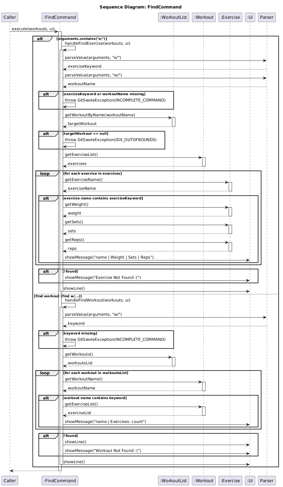

# Developer Guide

## Setup Guide
### Steps
1. Clone the repository to your local machine:
   ```bash
   git clone https://github.com/AY2526S2-CS2113-W10-3/tp
   ```
2. navigate into the project directory:
   ```bash
   cd tp
   ```
3. Run the application using Gradle:
   ```bash
   ./gradlew run
    ```
## Design

The **Architecture Diagram** below gives a high-level design overview of GitSwole.


Given below is a quick overview of the main components and how they interact with each other.

#### Main components of the architecture

**`GitSwole`** (the class `GitSwole.java`) is in charge of app launch and shut down:
- **At app launch:** It calls `setupLogger()`, instantiates `Ui` and `Storage`, loads persisted workout data into a `WorkoutList`, then enters the main command loop via `run()`.
- **At shut down:** When `Command.isExit()` returns `true`, the loop exits cleanly, and the application terminates.

The bulk of the app's work is done by the following four components:
- [**`UI`**](#ui-component): The user interface — responsible for reading raw user input and displaying all formatted output back to the terminal.
- [**`Parser`**](#parser-component): The command interpreter — handles complex string processing and flag extraction (e.g., `w/`, `e/`) to translate raw user input into executable `Command` objects.
- [**`Command`**](#command-component): The command executor — each subclass encapsulates the specific business logic for one operation (e.g., `AddCommand`, `DeleteCommand`).
- [**`Storage`**](#storage-component): The data persistence layer — manages file I/O operations for `workouts.txt` (templates) and `history.txt` (session logs).

**`Assets`** represents the in-memory data model, consisting of `WorkoutList`, `Workout`, and `Exercise`. **`Commons`** contains shared utility classes (e.g., `GitSwoleException`) used across all components.

#### How the architecture components interact with each other

The *Sequence Diagram* below shows how the components interact with each other for the scenario 
where the user issues the command `add w/Push Day`.


Each of the four main components:
- defines its API through a well-scoped class boundary.
- implements its functionality using a concrete class that can be substituted or tested independently.

### UI Component

**API:** `Ui.java`

The `Ui` component handles all interaction with the user - it reads raw input and
renders all output to the console. It has no knowledge of business logic or the data model.

It exposes the following key operations:
- `helloGreeting(WorkoutList)` - renders the startup banner, progress snapshot, and tier status.
- `byeGreeting()` - renders a goodbye message when the application terminates
- `readCommand()` - reads a single line of input from `System.in`.
- `showMessage(String)` - prints any general output line.
- `showError(String)` - prints a formatted error message wrapped in separator lines.
- `printWorkouts(ArrayList<Workout>)` - iterates through and prints all workouts and their exercises.
- `printWorkout(Workout)` - prints a single workout and its exercise list.
- `showLine()` - prints a horizontal separator for visual clarity.

> **Note:** `Ui` provides an overloaded constructor `Ui(InputStream in)` used exclusively
> for testing, allowing simulated input to be injected without modifying the production code path.


---

### Parser Component

**API:** `Parser.java`

The `Parser` component receives the raw input string from `GitSwole` and maps it to the
correct `Command` subclass. It uses an internal `HashMap<String, CommandType>` to perform
O(1) keyword lookups, avoiding long if-else chains.

It exposes the following key operations:
- `readResponse(String, WorkoutList)` - the main entry point; parses the full input string
  and returns a ready-to-execute `Command` object.
- `parseValue(String, String)` *(static)* - extracts the value of a named flag
  (e.g. `w/`, `e/`, `wt/`) from the input string using regex boundary detection.
- `parseOptionalInt(String, String, int)` *(static)* - extracts an optional integer flag
  value, returning a default if the flag is absent or malformed.

The following commands are currently recognised:

| Keyword | Maps to |
|---|---|
| `add` | `AddCommand` |
| `delete` | `DeleteCommand` |
| `edit` | `EditCommand` |
| `find` | `FindCommand` |
| `list` | `ListCommand` |
| `mark` / `unmark` | `MarkCommand` |
| `log` | `LogCommand` |
| `loglist` | `LogListCommand` |
| `help` | `HelpCommand` |
| `exit` | `ExitCommand` |

> **Note:** `parseValue` and `parseOptionalInt` are `public static` methods, allowing
> `Command` subclasses to reuse the same flag-parsing logic directly without re-instantiating
> a `Parser`.


---

### Command Component

**API:** `Command.java`

The `Command` component defines the contract that all executable actions must follow.
`Command` is an abstract class with a single abstract method:

```java
public abstract void execute(WorkoutList workouts, Ui ui) throws GitSwoleException;
```

Each concrete subclass encapsulates the full logic for exactly one user-facing operation.
The subclasses are:

- `AddCommand` - adds a new `Workout` or `Exercise` to the `WorkoutList`.
- `DeleteCommand` - removes a `Workout` or `Exercise` by index.
- `EditCommand` - modifies the name of an existing `Workout` or `Exercise`.
- `FindCommand` - searches for workouts by keyword.
- `ListCommand` - lists workouts at summary, workout-specific, or full-detail scope.
- `MarkCommand` - marks or unmarks a `Workout` as done.
- `LogCommand` - initialises a workout logging session or logs an individual exercise stat.
- `LogListCommand` - displays the full workout history from `HistoryStorage`.
- `HelpCommand` - displays all available commands and their formats.
- `ExitCommand` - sets `isExit = true` to signal the main loop to terminate.

The `isExit()` method is defined in the base class and returns `false` for all commands
except `ExitCommand`, which overrides it to return `true`.


---

### Storage Component

**API:** `Storage.java`, `HistoryStorage.java`

The `Storage` component is responsible for persisting and loading application data
to and from plain text files on disk. It is split into two classes with distinct responsibilities:

**`Storage.java`** manages the primary workout data file. It uses a structured
pipe-delimited format:


## Implementation

The design of GitSwole follows a modular architecture inspired by the N-tier pattern, specifically tailored for a 
CLI-based CRUD application. The system is divided into four primary logic components: `UI`, `Parser`, `Command`, 
and `Storage`. These components interact with a central `Assets` data model to perform operations. The application is 
designed to be extensible, allowing new commands and storage formats to be added with minimal friction by extending the 
base `Command` class and utilizing dedicated storage handlers.

### Ethan's enhancement
#### 1. Delete Feature

The delete mechanism is facilitated by the `DeleteCommand.java` class. It extends from the abstract class `Command` and overrides the `execute()` method, which throws the exception `GitSwoleException`, to execute the deletion of workouts/exercises.

**How it works:** It receives 2 types of commands: one that deletes the workout only, and one that deletes the workout and the exercise of that workout.

- `delete w/WORKOUT` — removes the entire named workout session
- `delete e/EXERCISE w/WORKOUT` — removes a specific exercise from that workout

**Examples:**
```
delete e/bench press w/pushday
delete w/pushday
```

#### Architecture & Component Level Design

When the user types in a command like the one shown above, it goes through the following process:

1. **Parser:** Reads the raw input (e.g. `delete e/bench press w/pushday`), extracts the command word `delete`, and returns a new `DeleteCommand(response)` with the full raw string passed as the argument. No index parsing occurs — the entire string is forwarded as-is.

2. **DeleteCommand:** The main loop calls `DeleteCommand#execute()`, which inspects the raw string for the presence of `e/` and `w/` flags to determine which operation to perform.

3. **WorkoutList:** The command delegates to either `WorkoutList#removeWorkout()` or `WorkoutList#removeExercise()`, both of which perform case-insensitive name matching to locate and remove the target entry.

4. **Ui:** The result (success or not found) is reported back to the user via `Ui#showMessage()`.

#### Sequence Diagram

This diagram shows the sequence in which the delete command is entered.


#### Design Considerations
**Alternative 1 (Considered): Delete by list index**

The user specifies the target by its position number in the list (e.g. `delete 1`).

- **Pros:** Much faster typing, as you do not need to type in the flags, and if you know the index of the workout that you want to delete.
- **Cons:** The user must first list the workouts in the list, then find their workout index, which might take an even longer time. Therefore, we decided to stick with the current implementation of using flags in our command.

---

#### Storage Feature

The `Storage` class saves and loads the data from `WorkoutList` through a plaintext file on the hardware memory. When the application is started and run, the previous data is immediately loaded into the application.

Each workout block consists of:

1. A `WORKOUT` header line with the workout name and completion status
2. Zero or more `EXERCISE` lines with name, weight, sets, and reps
3. A `---` separator marking the end of the block


#### Architecture and Component Level Design

1. **GitSwole:** Calls `loadWorkouts()` on startup to populate the `WorkoutList` before the main loop begins. Calls `saveWorkouts()` after every command that mutates the workout data.

2. **WorkoutList / Workout / Exercise:** The `Storage` class reads directly from these classes to get the output.

3. **File system:** `Storage` uses a `FileWriter` to write and a `Scanner` library to read from the plain text file `workouts.txt`. Parent directories are created automatically if they do not exist.

#### Sequence Diagrams

**Save:**


**Load:**


---

### Praveen's enhancement

This enhancement introduces a robust workout logging and history tracking system, along with a multi-tiered listing 
mechanism. It is composed of the `ListCommand`, `LogCommand`, `LogListCommand`, `HistoryStorage` classes, and the 
`history.txt` persistent file.

#### 1. Tiered Listing Feature (`ListCommand`)
The listing enhancement allows users to view their data at three different granularities without needing multiple, 
fragmented commands.

* **Implementation:**
    `ListCommand` extends the base `Command` class. It uses string matching on the parsed user input to route execution 
to one of three helper methods:
    - `handleListSummary()`: Triggered by `list`. Iterates through `WorkoutList` to show names and completion status.
    - `handleListWorkout()`: Triggered by `list w/`. Fetches a specific `Workout` and displays its nested `Exercise` list.
    - `handleListAll()`: Triggered by `list all`. Performs a deep iteration across all workouts and their exercises.

* **Design Considerations:**
    - **Why it is implemented this way:** Handling all list variations within a single `ListCommand` class centralizes 
the read-only display logic. It prevents "class explosion" and adheres to the DRY principle by reusing UI rendering methods.
    - **Alternatives considered:** Creating separate commands like `ListSummaryCommand` and `ListAllCommand`. This was 
rejected as it would clutter the parser logic and make the codebase harder to maintain.

#### 2. Smart Workout Logging (`LogCommand`)
The logging system allows users to record their real-time performance (weight, sets, reps) and persistent session data.

* **Implementation:**
    - `LogCommand` manages active sessions. It supports a "sticky" session state where the application remembers the last workout logged (via `setActiveWorkoutName`), allowing users to log multiple exercises without re-typing the workout name.

* **Design Considerations:**
    - **Why it is implemented this way:** The "sticky session" was implemented to improve User Experience (UX) in a CLI environment, reducing the number of keystrokes required during a workout.
    - **Alternatives considered:** Requiring the `w/` flag for every single exercise log. This was deemed too tedious for users who are actively training.

#### 3. Persistent History Storage (`HistoryStorage` & `history.txt`)
Unlike the primary `workouts.txt` which stores the current "template" or "routine", `history.txt` stores an 
immutable (but updatable for corrections) log of every completed session.

* **Implementation:**
    `HistoryStorage` implements a "Smart Overwriting" mechanism. When a user logs an exercise:
    1. It identifies the session block for the current date.
    2. It searches for the specific exercise entry within that block.
    3. If found, it updates the stats and remarks in-place instead of appending a new line.
    4. If not found, it appends the new entry to the end of the today's session block.

* **History File Format (`history.txt`):**
    The file uses a human-readable format with date headers and dashed separators:
    ```
    [29-03-2026, 14:30] PUSH DAY workout
    Bench Press       :   80kg |  3 sets | 10 reps
      Remark: Felt heavy today
    --------------------------------------------
    ```

* **Design Considerations:**
    - **Why it is implemented this way:** Smart overwriting was chosen to maintain data integrity and file cleanliness. 
If a user makes a typo and re-logs the same exercise, the previous entry is corrected rather than duplicated.
    - **Alternatives considered:** Append-only logging. While easier to implement, it leads to "data bloat" and 
makes it difficult for users to correct mistakes.

#### 4. Sequence Diagrams

The following sequence diagram illustrates how the `ListCommand` determines the scope of the listing and interacts with the `WorkoutList` and `Ui` components:


This sequence diagram shows the execution flow of the `LogCommand`, highlighting the "sticky session" logic and the interaction with `HistoryStorage`:


The following diagram details the internal "Smart Overwriting" mechanism within `HistoryStorage`:


---

### ShuoJie's enhancement: History Retrieval (`LogList`)

The `LogList` enhancement provides users with a dedicated way to view their past workout sessions chronologically. While the standard `list` command displays workout templates (routines), `loglist` retrieves actual performed data from the persistent history file.

#### Implementation

The `LogList` mechanism is centered around the `LogListCommand` class. It serves as the bridge between the `HistoryStorage` component and the `Ui` component.

**How it works:**
The execution flow involves the following steps:

1. **Initialization:** When the user enters `loglist`, the `Parser` identifies the keyword and returns a `LogListCommand` object.
2. **Data Fetching:** Upon calling `execute()`, the command requests all log data from `HistoryStorage#loadHistory()`.
3. **Validation:** The command checks if the returned list is empty. If no history exists (e.g., a new user), it directs the `Ui` to show a "No history found" message.
4. **Iterative Display:** If data exists, the command iterates through the list of log strings and calls `Ui#showMessage()` for each entry to render them in the terminal.

#### Sequence Diagram

The diagram below shows how the components interact when a user requests to see their workout history.


#### Design Considerations

**Aspect: Data Source for History**

* **Alternative 1 (Current Choice): Reading directly from `history.txt` via `HistoryStorage`.**
    * **Pros:** Ensures that the user sees the most up-to-date data saved on the disk, even if the file was edited manually. It keeps the memory footprint low as history is only loaded when requested.
    * **Cons:** Slightly slower than reading from an in-memory list because it requires File I/O.
* **Alternative 2: Keeping an in-memory `ArrayList` of history logs.**
    * **Pros:** Faster retrieval as no file reading is required during the command execution.
    * **Why Rejected:** As a user logs more workouts over months, keeping every historical entry in RAM is inefficient. Since `loglist` is not a high-frequency command (like `add` or `log`), the slight trade-off in speed for better memory management was preferred.

---

### Vetri's Enhancement

This enhancement introduces the help and exit commands, along with an in-place workout and exercise editing system.
It is composed of the `HelpCommand`, `ExitCommand`, and `EditCommand` classes.

#### 1. Help Command (`HelpCommand`)

The help feature displays a formatted reference of all available commands and their usage syntax directly in the 
terminal.

* **Implementation:**
  `HelpCommand` extends the base `Command` class. It stores all command descriptions in a 2D `String` array, where each
  row contains a command's syntax, its corresponding description, and an example.
* On `execute()`, it iterates through the array and renders each row through `Ui#showMessage()`.

* **Design Considerations:**
    - **Why it is implemented this way:** Using a 2D array loop instead of hardcoded individual print statements makes
      it trivial to add or update command entries — only the array data needs to change, not the rendering logic.
    - **Alternatives considered:** A series of individual `Ui#showMessage()` calls, one per command. This was rejected
      as it scatters the command reference data across multiple lines and makes maintenance error-prone.

#### 2. Exit Command (`ExitCommand`)

The exit feature cleanly terminates the application loop and displays a goodbye message.

* **Implementation:**
  `ExitCommand` extends the base `Command` class and overrides `isExit()` to return `true`. On `execute()`, it calls
  `Ui#byeGreeting()` to display the farewell message. The main loop in `GitSwole` checks `Command#isExit()` after every
  command execution and breaks out of the loop when `true` is returned, triggering a clean shutdown.

* **Design Considerations:**
    - **Why it is implemented this way:** Encoding the exit signal as an override of `isExit()` in the base `Command`
      class keeps the main loop uniform, every iteration checks the same method regardless of which command ran,
      with no special-casing needed for the exit path.
    - **Alternatives considered:** Throwing a dedicated `ExitException` to break out of the loop within `run()`.
      This was rejected because using exceptions for control flow is considered bad practice, as exceptions should
      signal unexpected errors, not a normal user-initiated shutdown. Declaring `ExitCommand` as a subclass of
      `Command` keeps the exit path uniform with every other command, requiring no special-casing in the main loop.

#### 3. Edit Workout and Exercise Feature (`EditCommand`)

The edit feature allows users to rename an existing workout or modify the details of
a specific exercise within a workout. It is facilitated by `EditCommand`, which interacts
with `WorkoutList` (to locate the target) and `Ui` (to drive an interactive prompt for new values).

#### *How does it work?*

**Edit Workout**
> Only the workout name is changed.

```
Input:  edit w/push
Prompt: Edit fields (e.g. wn/NewName):
Input:  wn/Push Day
Output: Change Recorded! Edited Workout:
        Push Day | Exercises: ...
```
**Edit Exercise**
> The workout name, exercise name, weight, sets, and reps can all be modified.

```
Input:  edit w/Push Day e/Bench Press
Prompt: Edit fields (e.g. wn/NewWorkout en/NewExercise wt/100 s/3 r/10):
Input:  wt/90 s/4 r/8
Output: Change Recorded! Edited Workout:
        Push Day
        Bench Press | Weight: 90kg | Sets: 4 | Reps: 8
```
#### Implementation

`EditCommand` extends `Command` and routes execution to one of two private handlers based
on the presence of the `e/` flag in the raw input string:

- `handleEditWorkout(WorkoutList, Ui)` — triggered when only the `w/` flag is present.
  Renames the target workout.
- `handleEditExercise(WorkoutList, Ui)` — triggered when both `w/` and `e/` flags are
  present. Edits the fields of a specific exercise within the target workout.

Given below is an example usage scenario for `edit w/Push Day e/Bench Press` and how
`EditCommand` behaves at each step.

**Step 1.** The user executes `edit w/Push Day e/Bench Press`. `Parser` creates an
`EditCommand` with the full input string and returns it to `GitSwole`.

**Step 2.** `GitSwole` calls `EditCommand#execute(workouts, ui)`. Since the input contains
`e/`, execution is routed to `handleEditExercise()`.

**Step 3.** `handleEditExercise()` calls `Parser.parseValue()` to extract the workout name
(`Push Day`) and exercise name (`Bench Press`). It calls `WorkoutList#getWorkoutByName()`
to retrieve the `Workout` object, then `Workout#getExerciseByName()` to retrieve the
`Exercise` object. A `GitSwoleException` is thrown if either is not found.

**Step 4.** The current workout and exercise details are2 printed via `Ui#printExercise()`.
`Ui#readLine()` is called to collect the user's edit input in the format
`wn/NewWorkout en/NewExercise wt/100 s/3 r/10`. Fields not provided are left unchanged.

**Step 5.** `applyExerciseEdits()` parses the edit line using `Parser.parseValue()` for
each supported flag (`wn/`, `en/`, `wt/`, `s/`, `r/`) and applies any non-null, non-empty
values to the target objects. The internal `hasChanged` flag is set to `true` for any
field that is modified.

**Step 6.** `printUpdatedWorkout()` checks `hasChanged`. If `true`, it calls
`Ui#printWorkout()` to show the updated workout. Otherwise, it notifies the user that
no changes were recorded.

The following sequence diagram shows how `edit w/Push Day e/Bench Press` is handled:


#### Design Considerations

**Aspect: How edit input is collected**

- **Alternative 1 (current choice):** Collect all edit fields in a single follow-up
  prompt after displaying the current state.
    - Pros: Familiar UX pattern (show-then-edit). Users can see the current values
      before deciding what to change.
    - Cons: Requires a second `readLine()` call mid-execution, making the control flow
      less uniform compared to other commands.
- **Alternative 2:** Multiple `readLine()` commands to get each change one-by-one.
    - Pros: Step-by-step guidance and easy to follow, especially for new users.
    - Cons: Longer process and seasoned user would be more comfortable typing all changes in one line.
      (e.g: `wn/push en/bench wt/100 s/3 r/10`)

---

### Wan's Enhancement

This enhancement introduces the search capability, which allows users to quickly locate workouts and exercises
within the application. It is composed of the `FindCommand` class.

####  Keyword-Based Find Feature (`FindCommand`)

The find mechanism allows users to search their data to two levels of extent — across all workouts, or within
a specific workout's exercise list.

**Implementation:**
  `FindCommand` extends the base `Command` class and overrides `execute()`. It uses flag detection on the raw input
  string to route execution to one of two helper methods:
    
`handleFindWorkout()`: Triggered by `find w/WORKOUT`. Scans all entries in `WorkoutList` via
      `WorkoutList#getWorkouts()` using case-insensitive keyword matching, then displays each match's name and
      exercise count.
      
`handleFindExercise()`: Triggered by `find e/EXERCISE w/WORKOUT`. First calls
      `WorkoutList#getWorkoutByName()` to pin down the target workout, then iterates its exercise list for matches,
      displaying name, weight, sets, and reps per result.

  In both cases, results are surfaced through `Ui#showMessage()`. If no matches are found, a "Not Found" message
  is displayed.

**Design Considerations:**
    
**Why it is implemented this way:** Centralising both search variants within a single `FindCommand` class
      keeps the flag-routing logic cohesive and avoids complicating the command hierarchy. The two-level search
      (workout vs. exercise) mirrors the natural hierarchy of the data model, making the feature easy to use.

**Alternatives considered:** Creating separate `FindWorkoutCommand` and `FindExerciseCommand` classes. This
      was rejected as it would complicate the parser and duplicate the shared flag-parsing and result-display logic.

#### 2. Sequence Diagram

The following sequence diagram illustrates how `FindCommand` determines the search scope and interacts with
`WorkoutList` and `Ui`:


 
---

## Product scope
### Target user profile

{Describe the target user profile}

### Value proposition

{Describe the value proposition: what problem does it solve?}

## User Stories

|Version| As a ... | I want to ... | So that I can ...|
|--------|----------|---------------|------------------|
|v1.0|new user|see usage instructions|refer to them when I forget how to use the application|
|v2.0|user|find a to-do item by name|locate a to-do without having to go through the entire list|

## Non-Functional Requirements
Performance:
Security:
Maintainability:
Portability:
{Give non-functional requirements}

## Glossary

* *glossary item* - Definition

## Instructions for manual testing

{Give instructions on how to do a manual product testing e.g., how to load sample data to be used for testing}
